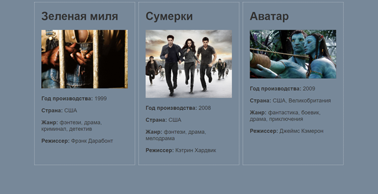

# Технологии верстки веб-страниц

Создайте страницы index.html, style.css и папку images.
На основе Flexbox-верстки разработайте блоки с анонсами кинофильмов.
Необходимо добавить не менее трех блоков.
В каждом блоке должны отображаться: название фильма, изображение, краткий текст.

Пример страницы:

После выполнения задания загрузите в этот репозиторий получившиеся файлы:
index.html, style.css, папку images и скриншот веб-страницы (Task3.jpg).
